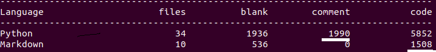

# 开源项目阅读02requests
最大收获在于代码可读性切分，以及变量命名的合理。

**需求驱动的模块划分**：一般是有公用方法才提出独立func，没有的话就大段代码堆积，除非非常长的代码，影响阅读效果，才会考虑切分。

**可读性驱动的模块划分**：request更多偏向于“注释型切分”，按照功能角色进行切分，哪怕只有几行代码，如果是独立小block，也会抽取出独立函数，通过函数名标识代码块功能，所以代码即使不看注释也很容易读懂(当然，request模块本身代码注释也很完善)。

## 基础
### 功能
request可以看做**基于urllib3的二次封装**，使得其更易用，所以本身逻辑性代码并不多，很多代码是异常处理或者兼容性处理和注释等。

**urllib、urllib2、urllib3的关系**

```
urllib和urllib2是独立的模块，并没有直接的关系，两者相互结合实现复杂的功能
urllib和urllib2在python2中才可以使用
requests库中使用了urllib3(多次请求重复使用一个socket)
```
**支持功能**

打开README.md文件：

```
Feature Support
---------------
Requests is ready for today's web.

-   International Domains and URLs #国际化域名和URLS
-   Keep-Alive & Connection Pooling #keep—Alive&连接池
-   Sessions with Cookie Persistence #持久性cookie的会话
-   Browser-style SSL Verification #浏览器式SSL认证
-   Basic/Digest Authentication #基本/摘要认证
-   Elegant Key/Value Cookies #简明的key/value cookies
-   Automatic Decompression #自动解压缩
-   Automatic Content Decoding #自动内容解码
-   Unicode Response Bodies #Unicode响应体
-   Multipart File Uploads #文件分块上传
-   HTTP(S) Proxy Support #HTTP(S)代理支持
-   Connection Timeouts #连接超时
-   Streaming Downloads #数据流下载
-   `.netrc` Support #'.netrc'支持
-   Chunked Requests #Chunked请求
```


### 代码量



可见comment和代码比例为1936:5852=1:3左右,开源代码大多数注释比较完备。

### 模块
网络请求参数类，包括 Request 和 PrepareRequest

网络请求返回类， Response

会话管理类，Session

实际网络请求处理类，包括 BaseAdapter 和 HTTPAdapter

以及 Cookie 管理， Auth 身份验证。

## 深度阅读,调用链


随便找一个requests.get()阅读，依次跟进各函数，就可以得到核心函数表，借此表，可得知各模块在request请求里的调用次序和功能角色。


## 广度阅读,模块简析


边缘模块简析:

api:接口的get,post封装,本质调用了:session.request(method=method, url=url, **kwargs)

compat:对py2和py3中不同的数据格式做了兼容处理，比较好

exceptions:一些异常

help:写的比较少，也不打算研究

hooks:只有一个干货方法

```
def dispatch_hook(key, hooks, hook_data, **kwargs):
    """Dispatches a hook dictionary on a given piece of data."""
    hooks = hooks or {}
    hooks = hooks.get(key)
    if hooks:
        if hasattr(hooks, '__call__'):
            hooks = [hooks]
        for hook in hooks:
            _hook_data = hook(hook_data, **kwargs)
            if _hook_data is not None:
                hook_data = _hook_data
    return hook_data
```
钩子函数，依次调用list()里各个函数，如果有返回值，把返回值单做下一阶段的入参


packages:

status_codes:状态码映射

structures:2个自定义数据结构CaseInsensitiveDict,LookupDict

utils:工具函数


需要重点学习的有:

adapters:

auth:

cookies:

models:

sessions:


## 模块解释(简单到复杂)
### httpbin
httpbin: A simple HTTP Request & Response Service.

简单来说：告诉你(resp)请求他时你带的参数，自测神器

关于httpbin细节，可阅读参考文献，learn_python/read_requests_v2.22.0/read_requests_v2.22.0.md。


### hooks(钩子)
简单来说就是一个接一个的函数调用，有点像django的中间件，层层调用。

代码:

```
def dispatch_hook(key, hooks, hook_data, **kwargs):
    """Dispatches a hook dictionary on a given piece of data."""
    hooks = hooks or {}
    hooks = hooks.get(key)
    if hooks:
        if hasattr(hooks, '__call__'):
            hooks = [hooks]
        for hook in hooks:
            _hook_data = hook(hook_data, **kwargs)
            if _hook_data is not None:
                hook_data = _hook_data
    return hook_data
```
说回之前的流程, 实例化属性self.hooks是 {'response' : [ ] } 这样的数据结构，类属性hooks是一个字典(可能为空,可能不为空)。然后通过对类属性hooks的主键和值进行迭代,并将键值对 作为参数传入继承而来的self.register_hook方法。

self.register_hook方法首先判断主键是否存在于实例化属性self.hooks之中,如果不存在则抛出错误，很明显,类属性hooks这个字典的主键值也只允许是'respones'，这也很好理解,因为我们回调函数也只有一个respones对象可以处理而已。

self.register_hook方法其次判断value值是否是可调用对象。

如果可调用就直接将其添加到实例化属性self.hooks数据 {'response' : [ ] }的值的列表中。

如果不可调用,则判断该value是否可被迭代。

如果可以被迭代再判断每个迭代的元素是否可以被调用，只将可以被调用的元素添加到实例化属性self.hooks数据 {'response' : [ ] }的值的列表中。

自此,实例属性self.hooks创建完成。


### structures
#### CaseInsensitiveDict
其中MutableMapping为抽象基类，类似Mapping。它们在collections模块中，供我们实现自定义的map类。Mapping包含dict中的所有不变方法，MutableMapping扩展包含了所有可变方法，但它们两个都不包含那五大核心特殊方法：getitem、setitem、delitem、len、iter。也就是说我们的目标就是实现这五大核心方法使该数据结构能够使用。

核心代码如下

```
class CaseInsensitiveDict(MutableMapping):
    def __init__(self, data=None, **kwargs):
        self._store = OrderedDict()#有序key的map
        if data is None:
            data = {}
        self.update(data, **kwargs)

    def __setitem__(self, key, value):
        # Use the lowercased key for lookups, but store the actual
        # key alongside the value.
        self._store[key.lower()] = (key, value)#转小写

    def __getitem__(self, key):
        return self._store[key.lower()][1]#? 为何[1]

    def __iter__(self):
        return (casedkey for casedkey, mappedvalue in self._store.values())#生成器

    def lower_items(self):
        """Like iteritems(), but with all lowercase keys."""
        return (
            (lowerkey, keyval[1]) #? 为何只取了[1]，既是第一个也应该是[0]，为何在eq中需要使用
            for (lowerkey, keyval)
            in self._store.items()
        )

    def __eq__(self, other):
        if isinstance(other, Mapping):
            other = CaseInsensitiveDict(other) #兼容普通map
        else:
            return NotImplemented
        # Compare insensitively
        return dict(self.lower_items()) == dict(other.lower_items())　#间接调用普通dict的__eq__

    # Copy is required
    def copy(self):
        return CaseInsensitiveDict(self._store.values())
```

#### LookupDict
本身只是个有名字(name)的map

```
class LookupDict(dict):
    """Dictionary lookup object."""

    def __init__(self, name=None):
        self.name = name
        super(LookupDict, self).__init__()
```
特殊的在于其用法

```
_codes = {

    # Informational.
    100: ('continue',),
    101: ('switching_protocols',),
    102: ('processing',),
    103: ('checkpoint',),
    122: ('uri_too_long', 'request_uri_too_long'),
    200: ('ok', 'okay', 'all_ok', 'all_okay', 'all_good', '\\o/', '✓'),
    }
=>键值对互换
codes.continue=100  
codes.uri_too_long=122  
codes.request_uri_too_long=122  
```
**键值对互换**且**多个键对应一个取值**


### auth
代码结构：


其中核心方法就是图中标出的build_digest_header()(摘要认证)

auth代码本身就是实现了http的基本认证和摘要认证(可以看做一种约定或协议)，所以阅读代码前先了解下http的基本认证和摘要认证。

```
基本认证
Base64(user:pwd)后，放在Http头的Authorization中发送给服务端来作认证.
用Base64纯只是防君子不防小人的做法。所以只适合用在一些不那么要求安全性的场合。

摘要认证
digest authentication（HTTP1.1提出的基本认证的替代方法）
这个认证可以看做是基本认证的增强版本，不包含密码的明文传递。
```
详情自行百度。明白了基本认证和摘要认证，这段代码基本也就看明白了，就是实现了一些**约定的规范**。

### adapters


实际的网络请求类包括 BaseAdapter 和 HTTPAdapter 。其中 BaseAdapter 只定义了基础的接口，而 HTTPAdapter 是对 BaseAdapter 的实现。

从类名，可看出这应该是适配器，结合前文中提过，requests本身是基于urllib3开发的，**而adapters就是对urllib3进行的二次封装**。

从函数名称也能大概看出，这里才是**真正执行上层(api,session)操作的模块**，扮演“执行者”或者“基层公务员”的角色。

关于适配器设计模式，参考博文:[08_适配器](http://hexo.yuanjh.cn/hexo/73f35716/)


核心代码为send(),简化后代码

```
def send(self, request, stream=False, timeout=None, verify=True, cert=None, proxies=None):
    conn = self.get_connection(request.url, proxies)

    self.cert_verify(conn, request.url, verify, cert)
    url = self.request_url(request, proxies)
    self.add_headers(request, stream=stream, timeout=timeout, verify=verify, cert=cert, proxies=proxies)

	resp = conn.urlopen(
		method=request.method,
		url=url,
		body=request.body,
		headers=request.headers,
		redirect=False,
		assert_same_host=False,
		preload_content=False,
		decode_content=False,
		retries=self.max_retries,
		timeout=timeout
	)
    return self.build_response(request, resp)
```
略过连接建立，超时机制，异常处理的部分，只看实际发送请求的部分：

从 urllib3 维护的 Connection Pool 中获取连接

进行SSL验证

url做转化(考虑使用代理的情况)

添加 request 头部 putheader

发送 request

接受 response

最后通过调用 build_response 来基于 urllib3 response 构建 request.Respnse 对象返回给用户，到此为止一次 requests.get() 动作便结束。


### sessions
上层入口api.py的调用都会到sessions这里，所以**这里才是requests里比较核心**的东西。

使用 Session 对象可以让你跨请求保持参数，在同一个 Session 实例中发出的网络请求可以保持 cookie，同一主机的 TCP 请求会被重用，从而带来性能提升。

```
保留参数信息 和 cookie
利用 urllib3 的连接池
可以为 request 对象提供默认数据
```


入口方法request:

```
def request(self, method, url,
    # Create the Request.
    req = Request(
        method=method.upper(),
        url=url,
        headers=headers,
        files=files,
        data=data or {},
        json=json,
        params=params or {},
        auth=auth,
        cookies=cookies,
        hooks=hooks,
    )
    prep = self.prepare_request(req)
    settings = self.merge_environment_settings(
        prep.url, proxies, stream, verify, cert
    )

    # Send the request.
    send_kwargs = {
        'timeout': timeout,
        'allow_redirects': allow_redirects,
    }
    send_kwargs.update(settings)
    resp = self.send(prep, **send_kwargs)

    return resp

```
可以拆分为以下四个步骤:

创建 Request 对象 request:根据用户传入的一系列传输构建的 request，用于准备真正传送出去的 PreparedRequest

创建 prepare request 对象 prep

发送 request send

send 返回值 response，返回给用户


**prepare_request**:相比原始request做了一定的二次加工,主要体现在几个merge_xx方法上

```
p = PreparedRequest()
        p.prepare(
            method=request.method.upper(),
            url=request.url,
            files=request.files,
            data=request.data,
            json=request.json,
            headers=merge_setting(request.headers, self.headers, dict_class=CaseInsensitiveDict),#改进
            params=merge_setting(request.params, self.params),#改进
            auth=merge_setting(auth, self.auth),#改进
            cookies=merged_cookies,#改进
            hooks=merge_hooks(request.hooks, self.hooks),#改进
        )
```
在构建网络请求参数时，调用了 merge_cookies() 方法将 Session 中的 cookies 与 本次请求的 cookies 合并了，因此使用同一个 Session 对象发起网络请求时才能实现跨请求保持 cookie。至于其他的参数，可以看到调用了 merge_setting() 方法进行了合并。  而在网络请求返回时，会将请求的必要信息，比如 cookie 保存在 Session 中。

**send**:发送逻辑

```
def send(self, request, **kwargs):
    kwargs.setdefault('stream', self.stream)
    kwargs.setdefault('verify', self.verify)
    kwargs.setdefault('cert', self.cert)
    kwargs.setdefault('proxies', self.proxies)

    hooks = request.hooks
    adapter = self.get_adapter(url=request.url)
    r = adapter.send(request, **kwargs)
    r = dispatch_hook('response', hooks, r, **kwargs)
    extract_cookies_to_jar(self.cookies, request, r.raw)

    return r
```
只是对hooks和cookie做了部分处理，主要逻辑send由adapter执行(adapter前文解释过，不在赘述).


## 架构
### 短方法(函数)
```
def get_adapter(self, url):
    """
    Returns the appropriate connection adapter for the given URL.

    :rtype: requests.adapters.BaseAdapter
    """
    for (prefix, adapter) in self.adapters.items():

        if url.lower().startswith(prefix.lower()):
            return adapter
```
其中:self.adapters

```
self.adapters = OrderedDict()
self.mount('https://', HTTPAdapter())
self.mount('http://', HTTPAdapter())
```
可以发现，很多短方法，如果不考虑_Init_部分，基本50行以上的都非常少，大多数30行以下。

而就本人开发经验而言，很多情况下，开发都是长方法，50+是比较常见的。

短方法最大好处是节约注释，但劣势就是对**命名和参数提炼**比较讲究，既可以标识出“**代码块功能**”，又能区分出和其他**代码块差异**（拆为step01(),step02(),step03()也是代码拆分,但是代码块差异则无法体现）。

### 阅读v0.10.0
核心调用链:api=>session(py).request()=>models(py).Request.send()


## 编码
### 长文本折行
```
 warnings.warn(
            "Non-string usernames will no longer be supported in Requests "
            "3.0.0. Please convert the object you've passed in ({!r}) to "
            "a string or bytes object in the near future to avoid "
            "problems.".format(username),
            category=DeprecationWarning,
        )
```
### all()函数
```
def __eq__(self, other):
    return all([
        self.username == getattr(other, 'username', None),
        self.password == getattr(other, 'password', None)
    ])
```
以下是 all() 方法的语法:

```
all(iterable)
```
参数:iterable -- 元组或列表。

返回值:如果iterable的所有元素不为0、''、False或者iterable为空，all(iterable)返回True，否则返回False；

注意：空元组、空列表返回值为True，这里要特别注意。

### 连续比较
```
if value[:1] == value[-1:] == '"':
```
### 变量函数

函数当做变量使用，避免if-else切入代码过多

```
get_proxy = lambda k: os.environ.get(k) or os.environ.get(k.upper())
if no_proxy is None:
    no_proxy = get_proxy('no_proxy')
```
### 上下文
先修改环境变量,使用后再恢复回来。

```
@contextlib.contextmanager
def set_environ(env_name, value):
    """Set the environment variable 'env_name' to 'value'

    Save previous value, yield, and then restore the previous value stored in
    the environment variable 'env_name'.

    If 'value' is None, do nothing"""
```
## 其他问题
python的动态类型的确很影响对代码的阅读和理解.

改进：通过类型注解(Type Annotations)（增加文档Decumentation String，函数注解）.


## 参考
Requests库请求过程简析：https://blog.csdn.net/weixin_41677555/article/details/85246464

python Requests 源码阅读：https://hustyichi.github.io/2019/08/10/requests-codes/

拆轮子系列：requests：https://www.jianshu.com/p/83ffcbe99bb2

python requests v2.22.0源码阅读:https://zhuanlan.zhihu.com/p/82694710

从Request库理解HTTP消息：https://www.cnblogs.com/yc913344706/p/7995225.html

用Python实现数据结构之映射：https://www.cnblogs.com/sfencs-hcy/p/10350475.html

python 找到dict值对应的键,读requests有感：https://www.jianshu.com/p/55f17668f156

如何阅读源代码（以 Python requests 库为例）:https://www.jianshu.com/p/145959b76ff3

learn_python/read_requests_v2.22.0/read_requests_v2.22.0.md:https://github.com/BigFlower666/learn_python/blob/master/read_requests_v2.22.0/read_requests_v2.22.0.md  