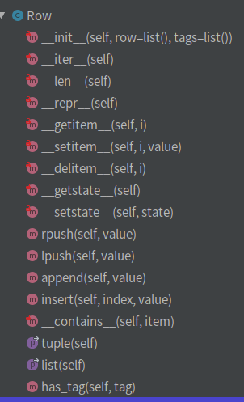

# 开源项目阅读03tablib
代码结构合理,支持多种数据格式，通过定义"内部格式"(row,dataset,databook)实现了多种格式的导入和导出。

功能角度类似pandas,也是管理多维表的，相对轻量级一些。这个真的很简单，大概看一下吧


## 基础
### 功能
Tablib 是一个**表格操作库**，使用python编写，目前(2020-07-11)支持如下格式：cli,csv,dbf,df (DataFrame),html,jira,json,latex,ods,rst,tsv,xls,xlsx,yaml的导入/导出，及修改操作。实现方法是使用各种数据格式的python支持库(大多是各种格式的有明支持库)导入数据成list（列表，python 内置数据结构），**每个list的成员就是数据表的一行(建立一个类Row)。对数据的操作就转化成对list和Row的操作。导出时，导出时又使用各库封闭的导出接口**就可以了。


使用样例代码(from:test测试案例):

```
def setUp(self):
    """Create simple data set with headers."""

    global data, book

    data = tablib.Dataset()
    book = tablib.Databook()

    self.headers = ('first_name', 'last_name', 'gpa')
    self.john = ('John', 'Adams', 90)
    self.george = ('George', 'Washington', 67)
    self.tom = ('Thomas', 'Jefferson', 50)

    self.founders = tablib.Dataset(headers=self.headers, title='Founders')
    self.founders.append(self.john)
    self.founders.append(self.george)


data.append(self.john)
data.append(self.george)
data.headers = self.headers

_csv = data.csv
```
### 代码量


comments和代码比例大约2:1，可见开源代码之“友好”。本人认为开源代码由于没有kpi压力，可以较好的代表研发人员的架构和编码水平，这样的**大牛的高质量代码都尚且需要如此高比例的注释**。那么国内大多研发人员或公司是不是应该汗颜。


### 模块


模块关系


## 深度阅读,调用链(略)

## 广度阅读,模块简析
core：Row，Dataset和Databook三个类

Tablib对表格的实现跟Excel中的表格概念是一致的，**一个Databook可以类比成一个Excel文件**，里边可以包含多个**Dataset（可以类比于Excel中的sheet**，代码中是self._datasets），而每一个Dataset中有可能会有表头headers（可选）是通过Python 的List存储的（代码中是self.__headers），每一个Dataset中会有很多行的数据（代码中是self._data），**每一行都是一个Row的实例**，而每一行中的元素则在Row的成员变量中用一个List来存储(代码中是self._row)，该List中的每一个元素对应于一个单元里边的值。


## 模块解释
### Row


初始化方法:

```
def __init__(self, row=list(), tags=list()):
    self._row = list(row)
    self.tags = list(tags)
```
通过self._row这一个成员变量来存储一行里边的所有元素，通过一些双下划线方法，**借助Python的语法糖对Row中的单元格数据的存取**。


### Dataset
和row类似，也是通过实现python的双下划线方法的语法糖，支持python的常见操作符。

另外为了提供所有的针对Dataset的操作，还实现了**表格的格式化，表格数据的验证**（用于当有新数据存进来的时候，确保新数据的格式跟表格是匹配的），以及不同格式的数据的导入和导出（主要依赖于formats模块）

初始化方法:

```
def __init__(self, *args, **kwargs):
    self._data = list(Row(arg) for arg in args)
    self.__headers = None

    # ('title', index) tuples
    self._separators = []

    # (column, callback) tuples
    self._formatters = []

    self.headers = kwargs.get('headers')

    self.title = kwargs.get('title')

```
### formats
以csv为例：实现了4个方法，从名字也可以看出功能。不再赘述。


### registry
tablib最有意思的就是这个模块了。整体上实现了按需求安装和动态import的能力(为了截屏能一次截完，对代码做了简化)


## 缺点
啥？大牛代码也有缺点？

任何事情有好处必然有坏处，事物自带属性，**享受一方面优惠的同时就要付出另一方成本**，哪怕大牛也无法避免。

**这里更多是见仁见智的问题**，可能很多人不认同。**代码采用了“动态编码导入”，享受的好处是避免了安装一堆自己不需要的软件包，带来的缺点丢失代码的依赖关系**，导致编译器无法识别（只有运行时才会真实的关联），**所以在formats文件夹下的类，通过编译器的find usages无法定位到哪里被使用了**，在debug时，这样的类导入方式带来难以定位，调试和追踪的问题。
## 参考
跟我一起读源码 – Tablib源码阅读：https://zhuanlan.zhihu.com/p/147786720

tablib源代码学习：https://www.cnblogs.com/hustlijian/p/3782525.html


