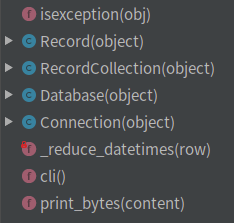
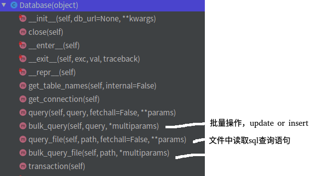

# 开源项目阅读04records

## 基础
只需要输入sql语句就可以把结果包成对象返回，极大的方便了用户（这个应该是早期结论，目前大多数开发框架都会集成ORM框，一样很方便，所以实用角度看，意义不大，抱着学习的态度看一看即可）  
借助项目（基于以下项目封装）：  
```
sqlalchemy：python的ORM框架
tablib：kennethreitz的另一个项目，主要是把数据处理为XLS, CSV, JSON, YAML格式返回。
```

## 用法
```
    db.query("SELECT * FROM users WHERE id = :user", user="Te'ArnaLambert")
```


## 广度阅读
   
Record储存每条数据的详情；RecordCollection储存query的查找结果，也就是Record的集合；Database数据库的操作集合。   
形象的来说：RecordCollection就是拉皮条的，手里有很多的Record，来源自Database，客户就是我们。。。。  
```

class Record(object):
    """A row, from a query, from a database."""
    __slots__ = ('_keys', '_values')#不使用dict,可减少内存占用

    def __init__(self, keys, values):
        self._keys = keys
        self._values = values

        # Ensure that lengths match properly.
        assert len(self._keys) == len(self._values)

class RecordCollection(object):
    """A set of excellent Records from a query."""
    def __init__(self, rows):#rows Record组成的列表
        self._rows = rows
        self._all_rows = []
        self.pending = True

def all(self, as_dict=False, as_ordereddict=False):
    """Returns a list of all rows for the RecordCollection. If they haven't
    been fetched yet, consume the iterator and cache the results."""

    # By calling list it calls the __iter__ method
    rows = list(self)#这个写法有点意思，本质是调用self.__iter__不断产生对象
```

  


## 评价
较好的利用了python的魔法方法特性，这也是python明显不同java等语言的地方，等价于对运算符的重载。  

## 参考
python库学习：records库源码分析：https://zhuanlan.zhihu.com/p/52605543  
