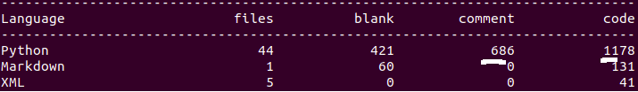
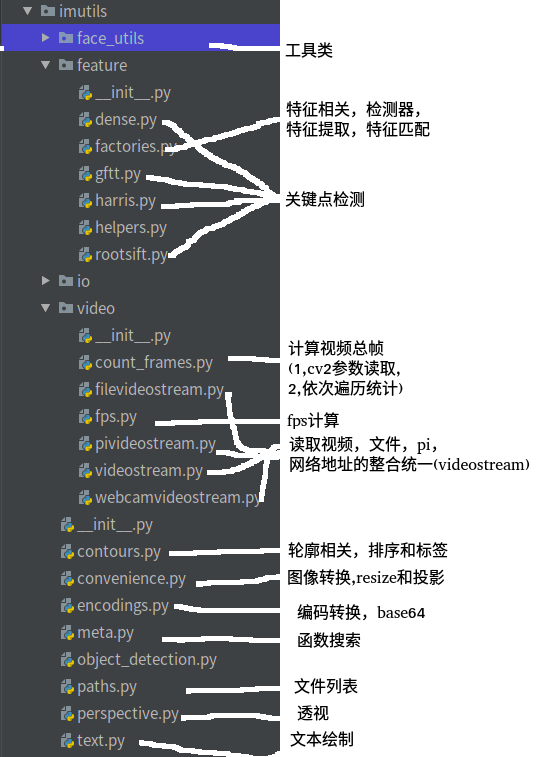

# 开源项目阅读05imutils
## 基础
### 功能
imutils 是一个图像处理工具包，它对 opencv 的一些方法进行了二次加工，使其更加简单易用。相比较于 opencv 的学习难度，导致很多方法使用起来需要一定的基础，新手可能会起步的较慢，而 imutils 使用起来比较便利，能够辅助我们理解 opencv
### 代码量


## 用法
### 查询opencv中的函数
可以使用关键词搜索opencv中的相应函数
```
import imutils  
imutils.find_function("area")  
#output:  
1. CC_STAT_AREA  
2. INTER_AREA  
3. contourArea  
4. minAreaRect 
```
### 图像平移Translation
图像在x轴方向左右平移，y轴方向上下平移，
```
#向右平移25像素，向上平移75像素  
translated = imutils.translate(image,25,-75)  
```
### 图像旋转Rotation
```
rotated = imutils.rotate(image,90)  
```
### 图像大小Resizing
改变图像大小，但保持原来图像的长宽比不变。
可以只单独设置width或者height；
```
resized = imutils.resize(image,width=300)  
resized = imutils.resize(image,height=300)  
```

### 骨架化Skeletonization
```
gray = cv2.cvtColor(logo, cv2.COLOR_BGR2GRAY)  
skeleton = imutils.skeletonize(gray, size=(3, 3))  
cv2.imshow("Skeleton", skeleton)  
```

### URL转换为Image
```
image = imutils.url_to_image(url)  
自动边缘检测Automatic Canny Edge Detection  
gray = cv2.cvtColor(logo, cv2.COLOR_BGR2GRAY)  
edgeMap = imutils.auto_canny(gray)  
#源码  
def auto_canny(image, sigma=0.33):  
    # compute the median of the single channel pixel intensities  
    v = np.median(image)  
    # apply automatic Canny edge detection using the computed median  
    lower = int(max(0, (1.0 - sigma) * v))  
    upper = int(min(255, (1.0 + sigma) * v))  
    edged = cv2.Canny(image, lower, upper)  
    # return the edged image  
    return edged  
```

## 深度阅读(略)

## 广度阅读


### dense
```
class DENSE:
    def detect(self, img):
        kps = []
        for x in range(0, img.shape[1], self.step):
            for y in range(0, img.shape[0], self.step):
                # create a keypoint and add it to the keypoints list
                kps.append(cv2.KeyPoint(x, y, self.radius))
```
cv2.KeyPoint是opencv中关键点检测函数detectAndCompute()返回的关键点的类，他包含关键点的位置，方向等属性

### gftt
```
class GFTT:
    def detect(self, img):
        cnrs = cv2.goodFeaturesToTrack(img, self.maxCorners, self.qualityLevel, self.minDistance,
                                       mask=self.mask, blockSize=self.blockSize,
                                       useHarrisDetector=self.useHarrisDetector, k=self.k)

        return corners_to_keypoints(cnrs)


def corners_to_keypoints(corners):
    """function to take the corners from cv2.GoodFeaturesToTrack and return cv2.KeyPoints"""
    if corners is None:
        keypoints = []
    else:
        keypoints = [cv2.KeyPoint(kp[0][0], kp[0][1], 1) for kp in corners]

    return keypoints
```
cv::goodFeaturesToTrack()，它不仅支持Harris角点检测，也支持Shi Tomasi算法的角点检测。但是，该函数检测到的角点依然是像素级别的，若想获取更为精细的角点坐标，则需要调用cv::cornerSubPix()函数进一步细化处理，即亚像素。

### harris
```
class HARRIS:
    def detect(self, img):
        gray = np.float32(img)
        H = cv2.cornerHarris(gray, self.blockSize, self.apertureSize, self.k)
        kps = np.argwhere(H > self.T * H.max())
        kps = [cv2.KeyPoint(pt[1], pt[0], 3) for pt in kps]
        return kps
```
函数主要用于检测图像的哈里斯（Harris）角点检测，
### factories
```
if is_cv2():
    def FeatureDetector_create(method):
        method = method.upper()
        if method == "DENSE":
            return DENSE()
        elif method == "GFTT":
            return GFTT()
        elif method == "HARRIS":
            return HARRIS()
        return cv2.FeatureDetector_create(method)

    def DescriptorExtractor_create(method):
        method = method.upper()
        if method == "ROOTSIFT":
            return RootSIFT()
        return cv2.DescriptorExtractor_create(method)

    def DescriptorMatcher_create(method):
        return cv2.DescriptorMatcher_create(method)

```

## 评价
整体比较简单，目前**估计已经不在维护了**(有40+个pull request了，猜测属于无人管理状态)，封装后的接口更易用，但也带来一定学习成本。建议当做opencv的学习材料阅读下即可，熟悉opencv里的方法函数（比如**fps计算和不同输入流的整合**）。实际项目中建议将代码**复制出来二次开发较好**，不建议在项目中使用不维护的项目。
在**代码方面可以优化的地方还是较多**的.
比如dense的detect双重循环，用推导表达式更好
```
for x in range(0, img.shape[1], self.step):
    for y in range(0, img.shape[0], self.step):
        # create a keypoint and add it to the keypoints list
        kps.append(cv2.KeyPoint(x, y, self.radius))
=>
[cv2.KeyPoint(x,y) for x in range(0, img.shape[1], self.step) for y in range(0, img.shape[0], self.step)]
```
再比如:
```
    def FeatureDetector_create(method):
        method = method.upper()
        if method == "DENSE":
            return DENSE()
        elif method == "GFTT":
            return GFTT()
        elif method == "HARRIS":
            return HARRIS()
        return cv2.FeatureDetector_create(method)
```
由于算法本身是无状态的.所以采用提前建立map("HARRIS":HARRIS)的方式可能更好。
并且其类名命名也不规范，有全部大写的类名,全部大写一般出现在枚举类中等类静态配置型变量中。

## 参考
imutils：https://blog.csdn.net/zimiao552147572/article/details/105919440
imutils–图像处理工具包：https://www.lizenghai.com/archives/25637.html
imutils库源码解析，看它如何调用opencv（一）- 基本函数：www.xiaoheidiannao.com/71631.html
