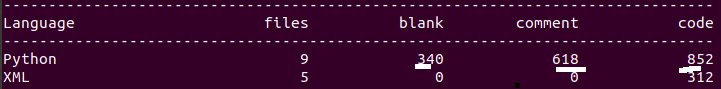
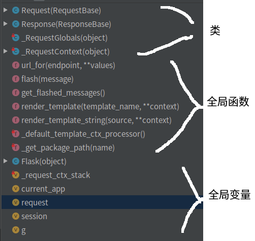
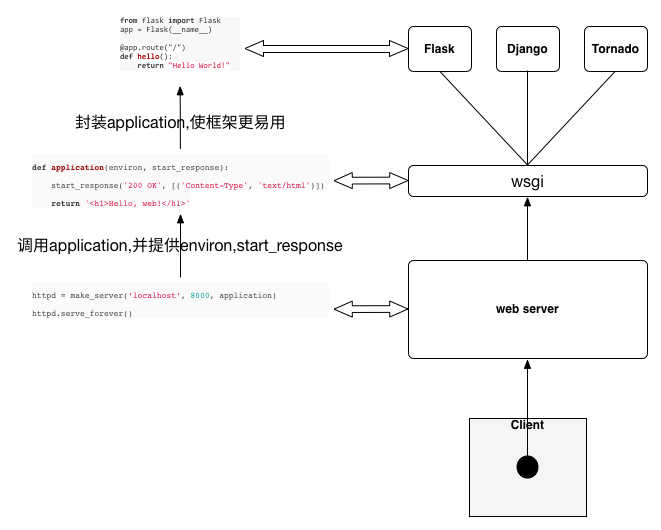
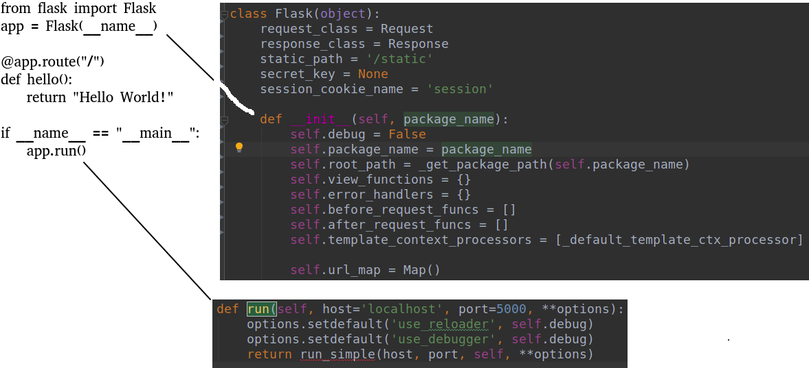

# 开源项目阅读06flask
## 基础
### 功能
Flask是一个使用 Python 编写的轻量级 Web 应用框架, 让我们可以使用Python语言快速搭建Web服务, Flask也被称为 "microframework" ，因为它使用简单的核心, 用 extension 增加其他功能。
flask可以看做对**jinja2和Werkzeug的二次封装**。
Jinja2是一个功能齐全的模板引擎。它有完整的unicode支持，所谓模板引擎，可简单理解为"**变量替换器**",将**网页的变量填充起来**。
Werkzeug是一个WSGI工具包。WSGI是一个web应用和服务器通信的协议，web应用可以通过WSGI一起工作。
由于Jinja2模板引擎工作简单且界限明确，可看做黑盒，所以将flask看做对Werkzeug的二次封装也ok。
### 代码量(v0.1)

总代码才800+，可见整体代码并不多。

### 模块
flask v0.1采用了单文件的方式,所有核心代码都在flask.py中


一共定义了五个类：
```
Request和Response, 它们分别是Flask的请求和响应对象，分别继承自Werkzeug中的请求和响应类
_RequestContext，请求上下文类。它包含了所有请求的相关信息。包括程序实例app，url匹配器，请求对象，session对象，g对象以及用于记录闪现的消息的flashes
_RequestGlobals，使用该类创建g对象，这个对象内没有任何的属性，你可以给该类的实例（即g）绑定任何的全局属性。
Flask，它是整个Flask框架的中心类，它实现了WSGI程序用于处理请求和响应，并且，它是整个所有视图函数、模板配置、URL规则的中心注册处。
```
另外，Flask中还定义了一些函数：如render_template、 url_for、flash、get_flashed_messages等

## 前置知识
下面这张图来自[这里](http://hackerxu.com/2015/05/10/flask011.html)，通过这张图，读者对web框架所处的位置和WSGI协议能够有一个感性的认识。

### WSGI
wikipedia上对WSGI的解释就比较通俗易懂。为了更好的理解WSGI，我们来看一个例子:
```
from eventlet import wsgi
import eventlet

def hello_world(environ, start_response):
    start_response('200 OK', [('Content-Type', 'text/plain')])
    return ['Hello, World!\r\n']

wsgi.server(eventlet.listen(('', 8090)), hello_world)
```
我们定义了一个hello_world函数，这个函数接受两个参数。分别是environ和start_response，我们将这个hello_world传递给eventlet.wsgi.server以后， eventlet.wsgi.server在调用hello_world时，会自动传入environ和start_response这两个参数，并接受hello_world的返回值。而这，就是WSGI的作用。
也就是说，在python的世界里，通过WSGI约定了web服务器怎么调用web应用程序的代码，web应用程序需要符合什么样的规范，只要web应用程序和web服务器都遵守WSGI 协议，那么，web应用程序和web服务器就可以随意的组合。这也就是WSGI存在的原因。
WSGI是一种协议，这里，需要注意两个相近的概念：
```
uwsgi同WSGI一样是一种协议  
而uWSGI是实现了uwsgi和WSGI两种协议的web服务器  
```
### jinja2
Jinja2是一个功能齐全的模板引擎。它有完整的unicode支持，一个可选 的集成沙箱执行环境，被广泛使用。
jinja2的一个简单示例如下:
```
>>> from jinja2 import Template
>>> template = Template('Hello !')
>>> template.render(name='John Doe')
u'Hello John Doe!'
```
### Werkzeug
Werkzeug是一个WSGI工具包，它可以作为web框架的底层库。
Werkzeug是一个WSGI工具包。WSGI是一个web应用和服务器通信的协议，web应用可以通过WSGI一起工作。一个基本的”Hello World”WSGI应用看起来是这样的: 
```
def application(environ, start_response):
    start_response('200 OK', [('Content-Type', 'text/plain')])
    return ['Hello World!']
```
上面这小段代码就是WSGI协议的约定，它有一个可调用的start_response 。environ包含了所有进来的信息。 start_response用来表明已经收到一个响应。 通过Werkzeug，我们可以不必直接处理请求或者响应这些底层的东西，它已经为我们封装好了这些。
请求数据需要environ对象，Werkzeug允许我们以一个轻松的方式访问数据。响应对象是一个WSGI应用，提供了更好的方法来创建响应。如下所示：
```
from werkzeug.wrappers import Response

 def application(environ, start_response):
    response = Response('Hello World!', mimetype='text/plain')
    return response(environ, start_response)
```
### wsgi, Werkzeug, flask之间的关系
Flask是一个基于Python开发并且**依赖jinja2模板和Werkzeug WSGI服务的一个微型框架**，对于Werkzeug，它只是工具包，其用于接收http请求并对请求进行预处理，然后触发Flask框架，开发人员基于Flask框架提供的功能对请求进行相应的处理，并返回给用户，如果要返回给用户复杂的内容时，需要借助jinja2模板来实现对模板的处理。将模板和数据进行渲染，将渲染后的字符串返回给用户浏览器。

### Flask是什么，不是什么
Flask永远不会包含数据库层，也不会有表单库或是这个方面的其它东西。**Flask本身只是Werkzeug和Jinja2的之间的桥梁**，前者实现一个合适的WSGI应用，后者处理模板。当然，Flask也绑定了一些通用的标准库包，比如logging。除此之外其它所有一切都交给扩展来实现。
## 深度阅读，调用链
### 入口


执行app.run()时，调用堆栈如下:
```
app.run()
    run_simple(host, port, self, **options)
        __call__(self, environ, start_response)
            wsgi_app(self, environ, start_response)
```
大多调用栈比较深，但代码都比较少，如果想深入学习，需要结合Werkzeug来看。

### flask请求响应流程(参考文献4)
Flask中定义了wsgi_app(self, environ, start_response)方法作为WSGI的程序，它并没有写死在__call__方法中，因此可以为其添加中间件。当请求到来时，WSGI服务器会调用此方法，并将请求的参数和用于发起响应的函数作为参数传递给它。
```
def wsgi_app(self, environ, start_response):
    with self.request_context(environ):
        rv = self.preprocess_request()  # 预处理请求
        if rv is None:
            rv = self.dispatch_request()  # 请求分发
        response = self.make_response(rv)  # 生成响应
        response = self.process_response(response)  # 响应处理
        return response(environ, start_response)
```
**Flask在with语句下执行相关操作，这会触发_RequestContext中的__enter__方法，从而推送请求上下文到堆栈中**。在with中，Flask先通过**preprocess_request()预处理请求，在preprocess_request()中调用所有在beforce_request()装饰器中注册的请求前要调用的函数**。随后，**Flask使用dispatch_request()来进行请求分发，获得视图函数的返回值或是错误处理器的返回值**。然后Falsk将请求分发时获得的返回值传给**make_response()方法来生成一个响应对象**，接下来，Flask在process_response()方法中**调用所有在after_request()装饰器中注册的请求完成后要调用的函数**。最后，通过response来发起一个响应，这会自动调用start_response方法来发起响应并将响应的值返回给WSGI服务器。
### 预处理(参考文献4)
```
def preprocess_request(self):
        for func in self.before_request_funcs:
            rv = func()
            if rv is not None:
                return rv
```
上面的函数会在实际的请求分发之前调用，而且将会调用每一个使用before_request()装饰的函数。如果其中某一个函数返回一个值，这个值将会作为视图返回值处理并停止进一步的请求处理。

### 请求分发(参考文献4)
```
def dispatch_request(self):
    try:
        endpoint, values = self.match_request()
        return self.view_functions[endpoint](**values)
    except HTTPException, e:
        handler = self.error_handlers.get(e.code)
        if handler is None:
            return e
        return handler(e)
    except Exception, e:
        handler = self.error_handlers.get(500)
        if self.debug or handler is None:
            raise
        return handler(e)
```
在上面的方法中，Flask对URL进行匹配获取端点值和参数，然后调用相应的视图函数并将视图函数的返回值返回，或者返回相应的错误处理器的返回值。这里的返回值不一定是响应对象，比如我们可以在视图函数中返回一个字符串或者是使用render_template()渲染好的模板，所以，为了能够将返回值转换成合适的对象，我们需要make_response()方法来生成响应

### 生成响应(参考文献4)
```
def make_response(self, rv):
    """
    rv允许的类型如下所示：
    ======================= ===============================================
    response_class          这个对象将被直接返回
    str                     使用这个字符串作为主体创建一个请求对象
    unicode                 将这个字符串进行utf-8编码后作为主体创建一个请求对象
    tuple                   使用这个元组的内容作为参数创建一个请求对象
    a WSGI function         这个函数将作为WSGI程序调用并缓存为响应对象
    ======================= ===============================================
    :param rv: 视图函数返回值
    """
    if isinstance(rv, self.response_class):
        return rv
    if isinstance(rv, basestring):
        return self.response_class(rv)
    if isinstance(rv, tuple):
        return self.response_class(*rv)
    return self.response_class.force_type(rv, request.environ)
```
在上面的方法中，也印证了我们上面所说的请求分发中视图函数的返回值不一定是请求对象这一点。所以，我们在make_response方法中对请求分发中获取的返回值的类型进行判断，通过不同的方式来创建真正的响应对象并返回。

### 响应处理(参考文献4)
```
def process_response(self, response):
    session = _request_ctx_stack.top.session
    if session is not None:
        self.save_session(session, response)
    for handler in self.after_request_funcs:
        response = handler(response)
    return response
```
响应处理和预处理请求类似，都会循环调用所有注册的请求后调用的函数来对响应对象response进行处理，不过在此之前会先将session添加到响应对象中。

### 返回响应(参考文献4)
我们Flask中的响应对象会继承自Werkzeug中的Response对象。Response的实例可以根据传入的参数，来发起一个特定的响应。你可以认为Response是你可以创建的另一个标准的WSGI应用，这个应用可以根据你传入的参数，来帮你做发起响应这件事。例如下面一个简易的WSGI程序：
```
def application(environ, start_response):
    request = Request(environ)
    response = Response("Hello %s!" % request.args.get('name', 'World!'))
    return response(environ, start_response)
```
好了，到此，Flask的一次请求就处理完了。不难发现，在Flask中，对Werzeug这个工具库是很依赖的，从请求处理，路由匹配，到发起请求，都可见到Werkzeug的身影。

## 广度阅读，模块简析
### 2个装饰器
self.url_map用以保存URI到视图函数的映射，即保存app.route()这个装饰器的信息，如下所示：
```
def route(...):
    def decorator(f):
        self.add_url_rule(rule, f.__name__, **options)
        self.view_functions[f.__name__] = f
        return f
    return decorator

def errorhandler(self, code):
    def decorator(f):
        self.error_handlers[code] = f
        return f
    return decorator
```

这里被装饰器修饰过的基本上不在程序中直接调用(find usage找不到)，而是"注册"到了
```
self.add_url_rule()
self.view_functions()
self.error_handlers
```
如果想知道代码真正执行点就需要从上面入手了.

### Local、LocalStack
这是flask中比较难理解的部分，位于flask.py尾部。
```
_request_ctx_stack = LocalStack()
current_app = LocalProxy(lambda: _request_ctx_stack.top.app)
request = LocalProxy(lambda: _request_ctx_stack.top.request)
session = LocalProxy(lambda: _request_ctx_stack.top.session)
g = LocalProxy(lambda: _request_ctx_stack.top.g)
```

向下追溯LocalStack
```
class LocalStack(object):
    def __init__(self):
        self._local = Local()

    def push(self,value):
        rv = getattr(self._local, 'stack', None) # self._local.stack =>local.getattr
        if rv is None:
            self._local.stack = rv = [] #  self._local.stack =>local.setattr
        rv.append(value) # self._local.stack.append(666)
        return rv


    def pop(self):
        """Removes the topmost item from the stack, will return the
        old value or `None` if the stack was already empty.
        """
        stack = getattr(self._local, 'stack', None)
        if stack is None:
            return None
        elif len(stack) == 1:
            return stack[-1]
        else:
            return stack.pop()

    def top(self):
        try:
            return self._local.stack[-1]
        except (AttributeError, IndexError):
            return None
```

再向下追溯Local
```
class Local(object):

    def __init__(self):
        object.__setattr__(self, '__storage__', {})
        object.__setattr__(self, '__ident_func__', get_ident)

    def __getattr__(self, name):
        try:
            return self.__storage__[self.__ident_func__()][name]
        except KeyError:
            raise AttributeError(name)

    def __setattr__(self, name, value):
        ident = self.__ident_func__()
        storage = self.__storage__
        try:
            storage[ident][name] = value # !!!划重点，storage第一级主键是ident,类似线程id
        except KeyError:
            storage[ident] = {name: value}
```
既然是storage[线程id]，那么猜测storage应该是全局的吧(全局含义是是进程内全局)
```
def __init__(self):
    object.__setattr__(self, '__storage__', {})
```
显然不是，storage是Local实例的属性。既然是实例属性，为何还需要做线程屏蔽呢？
别忘了，最外层的LocalStack()其实是一种单例(位于.py中最外层的只会被执行一次)，LocalStack()只会执行一次(也就是一个_request_ctx_stack）
再参考
```
class LocalStack(object):
    def __init__(self):
        self._local = Local()
```
也就是说只有一个Local(),所以其实也就只有个storage了，这也是为何storage需要做线程屏蔽的原因。
其实这里本人**有个疑问，为何采用这么复杂的方式，而不是直接用threadlocal**呢？

### 为何使用LocalProxy(部分摘录自参考文献3)
为什么一定要用proxy，而不能直接调用Local或LocalStack对象呢？这主要是在有多个可供调用的对象的时候会出现问题，如下图： 


我们再通过下面的代码也许可以看出一二：
```
# use Local object directly
from werkzeug.local import LocalStack
user_stack = LocalStack()
user_stack.push({'name': 'Bob'})
user_stack.push({'name': 'John'})

def get_user():
    # do something to get User object and return it
    return user_stack.pop()


# 直接调用函数获取user对象
user = get_user()
print user['name']
print user['name']
```

打印结果是：
```
John
John
```

再看下使用LocalProxy
```
# use LocalProxy
from werkzeug.local import LocalStack, LocalProxy
user_stack = LocalStack()
user_stack.push({'name': 'Bob'})
user_stack.push({'name': 'John'})

def get_user():
    # do something to get User object and return it
    return user_stack.pop()

# 通过LocalProxy使用user对象
user = LocalProxy(get_user)
print user['name']
print user['name']
```
打印结果是：
```
John
Bob
```
怎么样，看出区别了吧，直接使用LocalStack对象，user一旦赋值就无法再动态更新了，而使用Proxy，每次调用操作符(这里[]操作符用于获取属性)，都会重新获取user，从而实现了动态更新user的效果。见下图：

Flask以及Flask的插件很多时候都需要这种动态更新的效果，因此LocalProxy就会非常有用了。


**那么这个解释有问题么**？
想想这里的request,session,g是让谁调用的？当然是flask的使用方，就是web应用开发者。
如果**开发者调用一次session['xx']后，session对象就变成其他线程的session对象，那就麻烦了**.
继续深究
```
session = LocalProxy(lambda: _request_ctx_stack.top.session)

session['xx']=>等价于=>LocalProxy(lambda: _request_"ctx_stack.top.session)['xx']
```
结合
LocalPorxy部分源代码:
```
# LocalProxy部分代码

@implements_bool
class LocalProxy(object):
    __slots__ = ('__local', '__dict__', '__name__', '__wrapped__')

    def __init__(self, local, name=None):#!!! 划重点　这里的local就是 lambda: _request_"ctx_stack.top.session
        object.__setattr__(self, '_LocalProxy__local', local)
        object.__setattr__(self, '__name__', name)
        if callable(local) and not hasattr(local, '__release_local__'):
            # "local" is a callable that is not an instance of Local or
            # LocalManager: mark it as a wrapped function.
            object.__setattr__(self, '__wrapped__', local)

    def _get_current_object(self):
        """Return the current object.  This is useful if you want the real
        object behind the proxy at a time for performance reasons or because
        you want to pass the object into a different context.
        """
        # 由于所有Local或LocalStack对象都有__release_local__ method, 所以如果没有该属性就表明self.__local为callable对象
        if not hasattr(self.__local, '__release_local__'):
            return self.__local()
        try:
            # 此处self.__local为Local或LocalStack对象
            return getattr(self.__local, self.__name__)
        except AttributeError:
            raise RuntimeError('no object bound to %s' % self.__name__)

    @property
    def __dict__(self):
        try:
            return self._get_current_object().__dict__
        except RuntimeError:
            raise AttributeError('__dict__')

    def __getattr__(self, name):
        if name == '__members__':
            return dir(self._get_current_object())
        return getattr(self._get_current_object(), name)

    def __setitem__(self, key, value):
        self._get_current_object()[key] = value

    def __delitem__(self, key):
        del self._get_current_object()[key]

    if PY2:
        __getslice__ = lambda x, i, j: x._get_current_object()[i:j]

        def __setslice__(self, i, j, seq):
            self._get_current_object()[i:j] = seq

        def __delslice__(self, i, j):
            del self._get_current_object()[i:j]

    # 截取部分操作符代码
    __setattr__ = lambda x, n, v: setattr(x._get_current_object(), n, v)
    __delattr__ = lambda x, n: delattr(x._get_current_object(), n)
    __str__ = lambda x: str(x._get_current_object())
    __lt__ = lambda x, o: x._get_current_object() < o
    __le__ = lambda x, o: x._get_current_object() <= o
    __eq__ = lambda x, o: x._get_current_object() == o
```


同时可能注意到_get_current_object中getattr(self.__local,xx)但是self.__local是不存在的，其实就是
```
object.__setattr__(self, '_LocalProxy__local', local)
```
里面的_LocalProxy__local,
因为在类里面，双下划线标注的变量，会被自动转换为_yourclass__yourvariables的形式，你可以试下在某个类中定义一个双下划綫变量，然后实例化出来输出__dict__查看


继续前面的分析:
```
session['xx']=>等价于=>LocalProxy(lambda: _request_"ctx_stack.top.session)['xx']
＝> LocalProxy.__getattr__('xx')
def __getattr__(self, name):
    if name == '__members__':
        return dir(self._get_current_object())
    return getattr(self._get_current_object(), name)

=> self._get_current_object().xx
def _get_current_object(self):
    return getattr(self.__local, self.__name__)
    或者
    return self.__local()
    此处认为xx是普通属性，不可run()（localstack有__release_local__属性）,所以走前面(第一个)的分支代码

=> self.__local.xx#这里的__local是localstack的local
=> self.__storage__[线程id].xx
```
这才是正确解读，至于"参考文献3"解释虽然是正确的，但是走的_get_current_object的另一个分支代码

## 参考
浅谈flask源码之请求过程:https://www.jb51.net/article/144480.htm
Flask源码剖析详解:https://www.cnblogs.com/caoxing2017/p/8282530.html
Werkzeug(Flask)之Local、LocalStack和LocalProxy:https://www.jianshu.com/p/3f38b777a621
Flask源码浅析:https://www.cnblogs.com/tcctw/p/10743518.html
Flask源码剖析（二）:https://blog.csdn.net/weixin_42239402/article/details/97618844
Flask部分源码阅读:https://my.oschina.net/jianming/blog/2208507
flask-annotated:https://github.com/hhstore/annotated-py-projects/tree/master/flask


