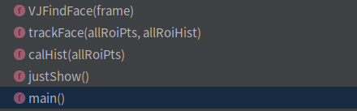
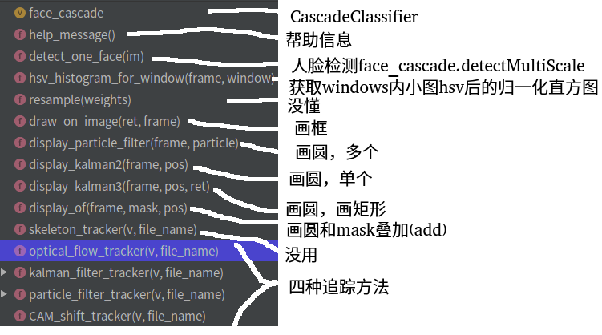

# 开源项目阅读07人脸检测和追踪
代码来源:github,search,face Detection and track
## dstoyanova/face-detection-and-tracking.git
主逻辑:VJCMS.py

###  主入口main
```
def main():
    global cap
    i=0
    while(cap.isOpened()):
        if i % 2 == 0:
            ret, frame = cap.read()
            allRoiPts = VJFindFace(frame)
            allRoiHist = calHist(allRoiPts)
        else:
            error = trackFace(allRoiPts, allRoiHist)
    cap.release()
    cv2.destroyAllWindows()

if __name__ == "__main__":
    main()
```
###  追溯VJFindFace
功能:绘图传入的frame,返回人脸坐标boxes的List(allRoiPts)
```
def VJFindFace(frame):
    dim = (frame.shape[1]/RATIO, frame.shape[0]/RATIO);
    resized = cv2.resize(frame, dim, interpolation = cv2.INTER_AREA)                
    gray = cv2.cvtColor(resized, cv2.COLOR_BGR2GRAY)        
    fd = FaceDetector('cascades/haarcascade_frontalface_default.xml')
    faceRects = fd.detect(gray, scaleFactor = 1.1, minNeighbors = 5, minSize = (10, 10))    
    for (x, y, w, h) in faceRects:
        # decrease the size of the bounding box
        x = RATIO*(x+10)
        y = RATIO*(y+10)
        w = RATIO*(w-15)
        h = RATIO*(h-15)            
   
        # insert the coordinates of each face to the list
        allRoiPts.append((x, y, x+w, y+h))        
    
    # show the detected faces
    cv2.imshow("Faces", frame)
    cv2.waitKey(1)  
    return allRoiPts
```
###  追溯calHist
功能:计算传入的各个boxes的小图的hsv空间的直方图,并对直方图归一化后返回,
```
def calHist(allRoiPts):
    global orig
    allRoiHist = []   
    for roiPts in allRoiPts:
        roi = orig[roiPts[1]:roiPts[-1], roiPts[0]:roiPts[2]]            
        roi = cv2.cvtColor(roi, cv2.COLOR_BGR2HSV)
        roiHist = cv2.calcHist([roi], [0], None, [16], [0, 180])
        roiHist = cv2.normalize(roiHist, roiHist, 0, 255, cv2.NORM_MINMAX)
        allRoiHist.append(roiHist);
    return allRoiHist
```
###  追溯trackFace
功能说明:用直方图反投影(calcBackProject)和CamShift算法，追踪其他帧的人脸信息,结果划线方式添加到frame中
```
def trackFace(allRoiPts, allRoiHist):        
    for k in range(0, TRACK):
        ret, frame = cap.read()
        i=0
        hsv = cv2.cvtColor(frame, cv2.COLOR_BGR2HSV)
        for roiHist in allRoiHist:
            backProj = cv2.calcBackProject([hsv], [0], roiHist, [0, 180], 1)
            (r, allRoiPts[i]) = cv2.CamShift(backProj, allRoiPts[i], termination)  
            for j in range(0,4):         
                if allRoiPts[i][j] < 0:
                    allRoiPts[i][j] = 0
            pts = np.int0(cv2.cv.BoxPoints(r))        
            cv2.polylines(frame, [pts], True, (0, 255, 255), 2)
            i = i + 1            
        cv2.imshow("Faces", frame)
        cv2.waitKey(1)
    return 1;
```
### 评价
程序本身还是非常简单的，**识别算法cv2.CascadeClassifier，追踪算法CamShift，中间用了直方图反传**(本人不才，至今没看懂直方图反传是如何辅助camshift，从而实现跟踪的)。
代码本身质量并不高，先不说**变量命名是否易懂规范**（高阶,这个难度很高，完美的变量命名是不再需要注释进行程序逻辑解释的，**变量名除了用了“标识”数据，让程序运行正确的角色外**，同时也担负着**解释程序功能，运行逻辑的角色**，这也就是为何很多受欢迎的开源代码中有非常多的短函数，哪怕只在一个地方被调用(言外之意,不是被强迫抽离为函数的),也要独立出来，就是为了更好的可读性，完成“注释代码”的角色），或者global变量的滥用(低阶)，**仅仅在循环中new VJFindFace就是个糟糕的方法**，会导致程序效率低下，这个问题是比较严重的。
这里也并非鄙视原作者，自己也曾写过很多烂代码，个人认为**烂代码是程序员成长的必经之路**，你无法对要求1**岁小孩抵挡你20岁的小伙子一拳，哪怕这小孩是未来的拳王**。

## shreyasbhatia09/Face-Detection-and-Tracking


### 主入口main
```
if __name__ == '__main__':
    question_number = 2

    # read video file
    video = cv2.VideoCapture('../Input/02-1.avi');

    if (question_number == 1):
        CAM_shift_tracker(video, "output_camshift.txt")
    elif (question_number == 2):
        particle_filter_tracker(video, "output_particle.txt")
    elif (question_number == 3):
        kalman_filter_tracker(video, "output_kalman.txt")
    elif question_number == 4:
        optical_flow_tracker(video, "output_of.txt")
```

## Linzaer/Face-Track-Detect-Extract
### 入口start.py
```
def main():
    tracker = Sort()
    pnet, rnet, onet = detect_face.create_mtcnn(sess, os.path.join(project_dir, "align"))
    cam = cv2.VideoCapture(video_name)
    if c % detect_interval == 0:
        faces, points = detect_face.detect_face(r_g_b_frame, minsize, pnet, rnet, onet, threshold,factor)
        judge_side_face( np.array(facial_landmarks))
    trackers = tracker.update(final_faces, img_size, directoryname, addtional_attribute_list, detect_interval)
    cv2.rectangle(frame, (d[0], d[1]), (d[2], d[3]), colours[d[4] % 32, :] * 255, 3)
```
### 追溯detect_face.create_mtcnn(sess, model_path):
```
with tf.variable_scope('pnet'):
with tf.variable_scope('rnet'):
with tf.variable_scope('onet'):
pnet_fun = lambda img
rnet_fun = lambda img
onet_fun = lambda img
return pnet_fun, rnet_fun, onet_fun
```
猜测是创建tf网络结构

### 追溯def detect_face(img, minsize, pnet, rnet, onet, threshold, factor)
```
这个有点复杂，尚未看懂
```
### 追溯def judge_side_face(facial_landmarks):
```
也没太懂
high_ratio_variance = np.fabs(high_rate - 1.1)  # smaller is better
width_ratio_variance = np.fabs(width_rate - 1)
```

### 追溯def update(self, dets, img_size, root_dic, addtional_attribute_list, predict_num):
```
matched, unmatched_dets, unmatched_trks = associate_detections_to_trackers(dets, trks)
for t, trk in enumerate(self.trackers):#已有搭配的track对象
    if t not in unmatched_trks:
        d = matched[np.where(matched[:, 1] == t)[0], 0]
        trk.update(dets[d, :][0])
        trk.face_addtional_attribute.append(addtional_attribute_list[d[0]])
for i in unmatched_dets:#没有搭配的track则创建新tracker
    trk = KalmanBoxTracker(dets[i, :])
    trk.face_addtional_attribute.append(addtional_attribute_list[i])
```

整体代码有点复杂，挺多地方看的不是很明白，等以后经验丰富了再回来看吧

## ZidanMusk/experimenting-with-sort 
### 入口main.py
```
def main():	
	detector = GroundTruthDetections()
	tracker =  Sort(use_dlib= use_dlibTracker) #create instance of the SORT tracker
	with open(out_file, 'w') as f_out:
        frames = detector.get_total_frames()
    	    for frame in range(0, frames):  #frame numbers begin at 0!
	        detections = detector.get_detected_items(frame)
	        trackers = tracker.update(detections,img)
	    `   for d in trackers:
	          plot(trackers)

```
### 追溯class Sort:创建新tracker或update已有tracker
```
def update(self,dets,img=None):
    for t,trk in enumerate(trks):
      pos = self.trackers[t].predict(img) #for kal!
    if dets != []:
       matched, unmatched_dets, unmatched_trks = associate_detections_to_trackers(dets,trks)
       #update matched trackers with assigned detections
      for t,trk in enumerate(self.trackers):
        trk.update(dets[d,:][0],img)    for dlib re-intialize the trackers ?!
       #create and initialise new trackers for unmatched detections
       for i in unmatched_dets:
        trk = KalmanBoxTracker(dets[i,:])
      self.trackers.append(trk)
```
看到这里基本清晰了。
main里面调用的tracker.update(detections,img)
实际内部可能update(已有tracker)，也可能是create(没有匹配tracker)
那么tracker和检测出的detection是如何匹配的呢?答案是计算iou，之后用匈牙利二分图匹配算法.


## twairball/face_tracking 
### 入口run
核心代码
```
def run	
	while True:
	    boxes, detected_new = pipeline.boxes_for_frame(frame)
	    draw_boxes(frame, boxes, color)
```
### 追溯pipeline
核心代码
```
def boxes_for_frame(self, frame):	
	if self.controller.trigger():
    	    return self.detect_and_track(frame)
	else:
	    return self.track(frame)

def __init__(self, event_interval=6):	
	self.controller = Controller(event_interval=event_interval)
	self.detector = FaceDetector()
	self.trackers = []

def detect_and_track(self, frame):
	faces = self.detector.detect(frame)
	self.trackers = [FaceTracker(frame, face) for face in faces]

def track(self, frame):	
	boxes = [t.update(frame) for t in self.trackers]
	return boxes, False
```
可见其机制在于
如果时间间隔足够久，则self.detect_and_track(detect消耗资源多，速度慢)
否则:self.track(frame)(因为track的消耗资源少，速度快)

### 追溯FaceDetector和FaceTracker
核心代码
```
class FaceDetector():
	def __init__(self, cascPath="./haarcascade_frontalface_default.xml"):	
		self.faceCascade = cv2.CascadeClassifier(cascPath)
	def detect(self, frame):	
		return self.faceCascade.detectMultiScale

class FaceTracker():	
	def __init__(self, frame, face):	
		self.tracker = cv2.TrackerKCF_create()
		self.tracker.init(frame, self.face)
	def update(self, frame):	
		return self.tracker.update(frame)
```
代码非常简单优雅,尤其是和上一部分的
```
faces = self.detector.detect(frame)
self.trackers = [FaceTracker(frame, face) for face in faces]
```
结合起来，一段时间后自动重新检测，重新更新所有track,代码通俗简单


### 评价
代码简单，明了，易懂。不论是变量命名还是代码结构，都比较合理，这才是“诗一样的代码”。

## dlib 目标跟踪
地址:https://blog.csdn.net/weixin_40277254/article/details/82188461
使用dlib.correlation_tracker实现目标跟踪基本分以下四步：
dlib.correlation_tracker()创建一个跟踪类；
start_track()中设置图片中的要跟踪物体的框；
update()实时跟踪下一帧；
get_position()得到跟踪到的目标的位置。

核心代码:
```
tracker = dlib.correlation_tracker()   # 导入correlation_tracker()类
while(1):
	if(第一帧)
		tracker.start_track(image, dlib.rectangle(track_window[0], track_window[1], track_window[2], track_window[3]))
	else:
		tracker.update(image)     #更新，实时跟踪
	box_predict = tracker.get_position()      #得到目标的位置
	cv2.rectangle(image,(int(box_predict.left()),int(box_predict.top())),(int(box_predict.right()),int(box_predict.bottom())),(0,255,255),1)
	cv2.imshow('image',image)
cv2.destroyAllWindows()
```

## ITCoders/Human-detection-and-Tracking
入口main.py
```
recognizer.read("model.yaml")#读取训练好的人脸识别模型（所以后面直接predict了)
for video in list_of_videos:
    while True:
        temp = background_subtraction(previous_frame, frame_resized_grayscale, min_area)#图片变化是否超过阈值
        if temp == 1:
            frame_processed = detect_people(frame_resized)#检测人
            faces = detect_face(frame_resized_grayscale)#检测脸
            if len(faces) > 0:
                frame_processed = draw_faces(frame_processed, faces)#图片上画出脸
                label = recognize_face(frame_resized, faces)#识别人
                frame_processed = put_label_on_face(frame_processed, faces, label)#画出的脸添加标签(姓名)

            cv2.imshow("Detected Human and face", frame_processed)
```
代码简单，不在赘述
这个项目的scripts里面有很多脚本，对于opencv的学习比较有帮助，有兴趣自行阅读


## 其他
nishagandhi/Face-Detection-and-Tracking(略,shr的早期版本)
brpat07/Face-Detection-and-Tracking

## 参考
Python-OpenCV创建人脸识别器(LBPHFaceRecognizer_create的使用方法)：https://blog.csdn.net/weixin_44803791/article/details/103203143
基于LBPH的人脸识别（LBPHFaceRecognizer_create的使用方法，仅预测）：https://www.cnblogs.com/monsterhy123/p/12930903.html
目标跟踪初探（DeepSORT）:https://zhuanlan.zhihu.com/p/90835266
图像人脸进行检测、识别和跟踪(大小,分辨率,模糊,光照,角度,遮挡)：https://blog.csdn.net/zhiboxu9716/article/details/79344910
python OpenCV 图片相似度 5种算法(均值哈希算法相似度、差值哈希算法相似度、感知哈希算法相似度、三直方算法相似度、单通道直方图相似度)：https://blog.csdn.net/enter89/article/details/90293971

